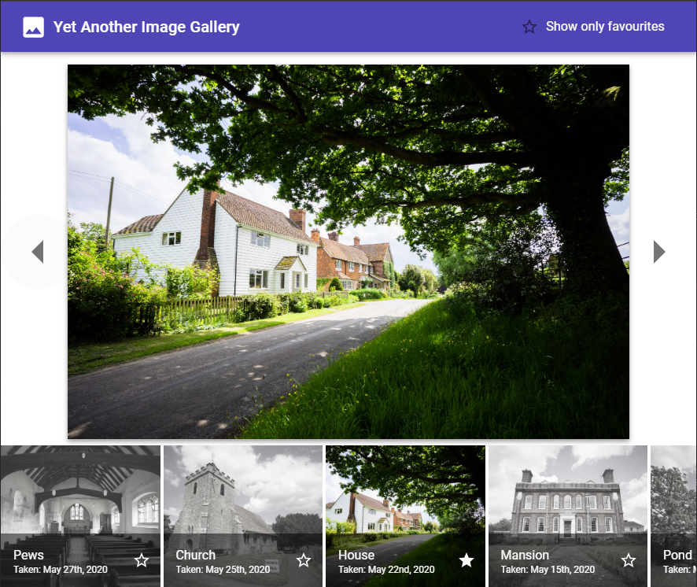

# Gallery Explorer

Gallery explorer is a simple React-based application designed to show a gallery of images to a user. Users will also be able to "favorite" items.

Before running, make sure to run `npm install` in both the `client` and `server` directories. Also, make sure that MongoDB is installed and that dummy data has been added to the database.

Once the server is running (`npm start`) from within the `server` directory) and dummy data has been added using <http://localhost:10000/api/init>, then srat the client (`npm start` from within the `client` directory). A simple webpage should be displayed at <http://localhost:3000/> .
